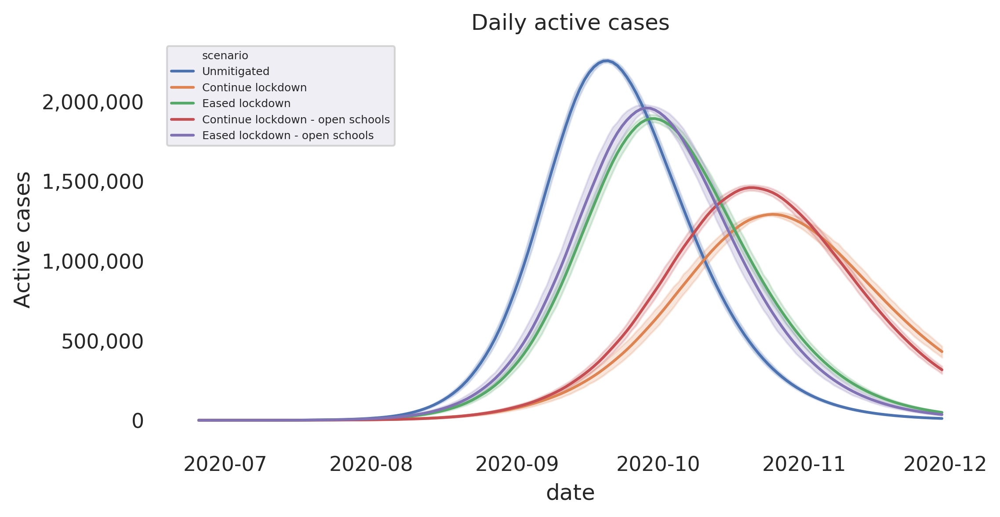
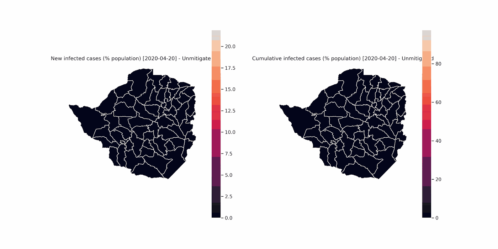

# Agent-based Model (ABM) for CoVid19

This repository contains the implementation of the agent-based model used to model the spread of COVID-19.

## Description

The model consists of individual agents with basic demographic and household information. The agents can be parametrized by a census data; in this model a 5% sample of the IPUMS census data for Zimbabwe was used to generate a synthetic population equivalent to roughly ~100% of the population size.

The agents are classified based on economic activity. For each economic activity, we define an economic activity-based interaction matrix. This interaction matrix embeds the relative proportion that an agent from a given economic activity will interact with another agent belonging to another economic activity.

Mobility data from call-detail records (CDR) was used to parametrize the inter-district movement of agents. For each day, a proportion of agents travel and stay for some time to other districts as informed by the empirical data. This allows the model to simulate spatiotemporal propagation of the disease that is driven by human mobility.

Intra-district mobility is also parametrized to model adherence of individuals to local mobility restrictions.

The model also incorporates Water, Sanitation, and Hygiene (WASH) and co-morbidity risks in the propensity of infection.

Since the agents in the model possess economic activity information, this allows the simulation of scenarios such as schools closure and opening of certain sectors of the economy.

To improve the speed of the model to simulate millions of agents, a **time-to-next-event strategy** and a **vectorized implementation** was done.

## Sample output

The following visualizations are generated from the output of the model. Shown below is a graph of the disease case trajectories for various scenarios. Also shown are example spatiotemporal propagation of the outbreak for both unmitigated and a lockdown scenario.

### Case trajectories

### Spatiotemporal propagation in unmitigated scenario

Without any mitigation, we see a sweeping spread of the disease across the entire region which will result to massive undersupply of healthcare facilities.

### Spatiotemporal propagation in a selective lockdwon scenario

In this scenario, we can see that multiple waves of infection is likely to be expected in a policy where only districts with high mobility are put on lockdown.

## Data dependency

The model uses the following data to model various scenarios:

1. Agent data containing the following attributes:
   - person_id
   - age
   - sex
   - household_id
   - ward_id
   - economic_status
   - economic_activity_location_id
   - (Optional) school_goers
   - (Optional) manufacturing_workers
   - (Optional) mining_district_id

2. Mobility data containing the number of people from district X who have gone to district Y. Length of stay: mean and standard deviation are also parameters of the model.

3. WASH and comorbidity risk data.

### Data preparation notebooks

Most of the input data come from raw data sources. Notebooks used to process the raw data into formats accepted by the model are found in the `notebooks` directory.

The preprocessing notebook needed to generate the input for the agents data is found in `notebooks/census/Zimbabwe Raw Data Full Simulated School Mining Manufacturing.ipynb`.

The preprocessing notebooks needed to generate inputs using the mobility data can be found in `notebooks/mobility`.

Processing of the risk component to the model can be found in `notebooks/risk/Process hand washing and severe disease risk.ipynb`.

Additional parameters are contained in `src/covid19_abm/params.py`.

## Running the model

1. The core model implementation can be found in `src/covid19_abm/base_model.py`.

2. A script in `scripts/run_simulation_scenarios_full_data.py` can be configured to identify which scenarios will be simulated and basic parameters such as `R0` can be defined.

3. Specification of scenarios are defined in `src/covid19_abm/scenario_models.py`

## Notice

This repository may contain some codes and/or notebooks that may break since this was migrated from a different workspace. Kindly report any problems using Github's issues or e-mail me at asolatorio@worldbank.org or avsolatorio@gmail.com.

Any errors found in the model implementation and/or logic are highly encouraged to be reported using the same channel.
